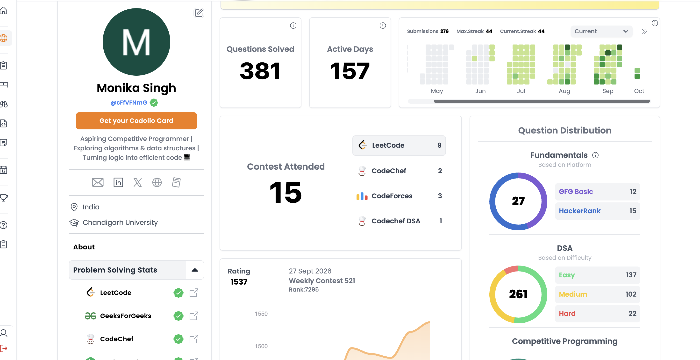

  

# Hi 👋, I'm Monika Singh

### 👩‍💻 About Me

I'm a Computer Science Engineering student interested in **programming, problem-solving, software development, and AI/ML**. I enjoy learning new technologies and building things that help me grow as a developer.

---

### 🏆 Highlights

🏆 NPTEL Certified — Cloud Computing
🏆 Project Expo 2025 — Chandigarh University
🏆 Tekathon 4.0 — Internal SIH Hackathon
🤖 IEEE Computational Intelligence — Volunteer

---

### 🚀 Currently

💻 Practicing **Data Structures & Algorithms**
🌐 Exploring **Full-Stack Development**
🤖 Learning **AI & Machine Learning**

---

### 🛠️ Languages & Tools

**Languages:**
`C` `C++` `Java` `Python` `JavaScript`

**Technologies:**
`React` `Node.js` `Express.js` `MongoDB` `Tailwind CSS`

**Tools:**
`Git` `GitHub` `VS Code`

---

### 📊 Coding Profile

  

---

### 📫 Connect With Me

  
  
  
  

  ⭐ <i>Thanks for visiting my profile!</i> ⭐

